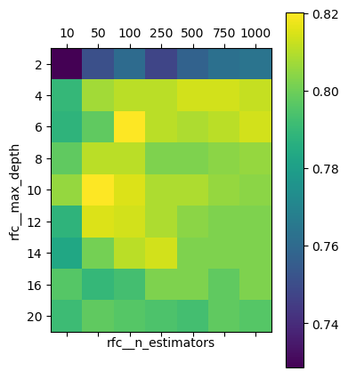

DATA 622 # hw2

	Assigned on September 27, 2018
	Due on October 17, 2018 11:59 PM EST
	15 points possible, worth 15% of your final grade

1. Required Reading

	Read Chapter 5 of the Deep Learning Book
	Read Chapter 1 of the Agile Data Science 2.0 textbook

2. Data Pipeline using Python (13 points total)

	Build a data pipeline in Python that downloads data using the urls given below, trains a random forest model on the training dataset using sklearn and scores the model on the test dataset.

	Scoring Rubric

	The homework will be scored based on code efficiency (hint: use functions, not stream of consciousness coding), code cleaniless, code reproducibility, and critical thinking (hint: commenting lets me know what you are thinking!)
Instructions:

	Submit the following 5 items on github.
	ReadMe.md (see "Critical Thinking")
	requirements.txt
	pull_data.py
	train_model.py
	score_model.py

More details:

requirements.txt (1 point)  
This file documents all dependencies needed on top of the existing packages in the Docker Dataquest image from HW1. When called upon using pip install -r requirements.txt , this will install all python packages needed to run the .py files. (hint: use pip freeze to generate the .txt file)

pull_data.py (5 points)  
When this is called using python pull_data.py in the command line, this will go to the 2 Kaggle urls provided below, authenticate using your own Kaggle sign on, pull the two datasets, and save as .csv files in the current local directory. The authentication login details (aka secrets) need to be in a hidden folder (hint: use .gitignore). There must be a data check step to ensure the data has been pulled correctly and clear commenting and documentation for each step inside the .py file.
	Training dataset url: https://www.kaggle.com/c/titanic/download/train.csv
	Scoring dataset url: https://www.kaggle.com/c/titanic/download/test.csv

train_model.py (5 points)  
When this is called using python train_model.py in the command line, this will take in the training dataset csv, perform the necessary data cleaning and imputation, and fit a classification model to the dependent Y. There must be data check steps and clear commenting for each step inside the .py file. The output for running this file is the random forest model saved as a .pkl file in the local directory. Remember that the thought process and decision for why you chose the final model must be clearly documented in this section.
eda.ipynb (0 points)  

[Optional] This supplements the commenting inside train_model.py. This is the place to provide scratch work and plots to convince me why you did certain data imputations and manipulations inside the train_model.py file.  

### Response

This script uses built-in transformations on the input data using a Pipeline() after a few custom transformations.  Through additional research, I found that there is a way to build custom transformation functions, which means that it might be possible to put everything in the Pipeline object; however, this operation seems a little complex for the task at hand and further testing/research is required for me to implement it.  The reason for the custom operations is to remove the target values from the training data, remove columns we do not wish to analyze, and propery format columns that were misread in the csv import.  For a fully integrated solution, we could, and definitely should, create a custom transformation function to be inserted into the Pipeline [itself](https://bradzzz.gitbooks.io/ga-seattle-dsi/dsi/dsi_05_classification_databases/2.2-lesson/readme.html), but for the purposes of this assignment, i've just applied it before each run into the Pipeline().  

After the transformations have been completed, the data is split between numerical and categorical columns and the preproccessed.  Numerical data simply has missing values imputed while categorical data is imputed and also transformed into multiple columns for each category type using OneHotEncoder().  

After pre-processing, the random forest model is trained.  In this section I added an option to test and display the results of some hyperparameter options from a grid search.  Below is the result from the last run (Note, the cross validation is randomized so there will be some variation from the actual hyperparameters selected):  



The model is then fit to the training data and saved as a pickle file.  Note, the best parameters are not fed into the model, these are manually entered so that we can ensure to see them before implementing.  

This entire process (pull, train, score) can be run in a docker container by just entering ```docker build -t [TAG_NAME] .``` and then entering the image via shell.  Note, there are limitations in this process due to the fact that we are trying to download local copies of the training and test data.  In future weeks we will alleviate this issue by referencing a remote repository with files kept in a cloud storage.  

Additional Notes:  
In order to pull the training data, the user has to enter a credentials file in the HiddenFiles/ directory called credentials.txt.  However, for this homework, I have included the .csv file in the github repository so if it is present in the main directory then the program will not attempt to re-pull the data.  This is also good because it avoids unnecessarily pinging kaggle.com and requesting data files that are already present.  For future versions, we will make a centralized repository to pull this information from so that we do not need to download it every time.  

score_model.py (2 points)  
When this is called using python score_model.py in the command line, this will ingest the .pkl random forest file and apply the model to the locally saved scoring dataset csv. There must be data check steps and clear commenting for each step inside the .py file. The output for running this file is a csv file with the predicted score, as well as a png or text file output that contains the model accuracy report (e.g. sklearn's classification report or any other way of model evaluation).

3. Critical Thinking (2 points total)  
Modify this ReadMe file to answer the following questions directly in place.  
   1) Kaggle changes links/ file locations/login process/ file content  

      The current code provided in this homework uses the direct links provided, as requested.  However, kaggle does have an [API](https://www.kaggle.com/docs/api) which allows users to make requests in a formatted manner.  This is a much more reliable solution to solving issues with authentication and file location references.  Also, we could create an s3 instance and make an automated script (e.g. via cron) where we check the link and update the file on a recurring basis if it has changed or have it notify us if the link no longer works.  As always, it's best to test the download to make sure the link worked and throw an error if something unexpected happened.  

   2) We run out of space on HD / local permissions issue - can't save files  

      We could read the files via a temporary file; however, that might not be the best solution.  If we want to keep a hardcopy somewhere, we could use amazon's s3 service (again) and just read the stored file [directly](https://stackoverflow.com/questions/46943166/python-how-to-read-csv-file-retrieved-from-s3-bucket?rq=1) into memory.  This way, we do not need to save the file to the local directory to avoid both the space and permission issue.  Also, from the reading (Agile Data Science 2.0) this would be a good way to set up a data pipeline where we have a centralized storage that can be accessed from multiple remote machines.  

   3) Someone updated python packages and there is unintended effect (functions retired or act differently)  

      One part of using pip freeze is that the modules would be 'frozen' to their specific versions.  If the question is pertaining to the actual version of Python that is being used, then this can be solved by using Anaconda.  You might notice that there are many additional requirements in my frozen file that we actually need to run these specific files.  It is that way because I have created an Anaconda environment that will lock the python version that is being used.  Therefore, when we call this environment we get exactly the same version we specified when we created these scripts.  I know it could be a little more efficient by knocking out some more of the packages but the assignment request to do something like a pip freeze so I just followed that.  Really, if we are just running only these specific .py files, there is much reduction that can be done in the requirements.txt file.  For a distributed solution, we can do the same thing where we download Anaconda (or miniconda), specify the specific python version, and install the necessary modules.  Alternatively, as was done in this homework, one can create a Docker file which references a specific Python version for the image.  

   4) Docker issues - lost internet within docker due to some ip binding to vm or local routing issues( I guess this falls under lost internet, but I am talking more if docker is the cause rather then ISP)  

      1. Internet - I'm unsure if the "lost internet" portion of this question is leftover from the previous student's response but i'll try to answer it.  Basically lost internet is a real problem that will cause delays in most issues.  The best options available would be to download/package as much data as you can and to add some conditional loops to check/retry connections for set periods of time and to stop all running processes if there is an extended amount of time that we are going without internet  

      2. General Docker Issues - Docker does appear to have a steep learning curve.  The most difficult part of it is when an image is created, we try to run it, and we get no response.  For those issues, I've found that running in interactive mode (instead of detached) works well.  Also, there is a ```docker logs``` command that you can use to see what is going on; however, I like to set up logging files in python as well so that if there is an error within the scripts themselves they get passed to the logging file.  Then you can go into the image using ```docker run -it <image name> /bin/bash``` and see what happened.  Note, you want to install nano or some other text-editor that can be run in a shell.  On a side note, docker containers can take up a lot of room, especially when you have multiple ones created (usually during test), so i try to remember to run ```docker system prune --all``` whenever I can to remove any containers that are in a running image.
